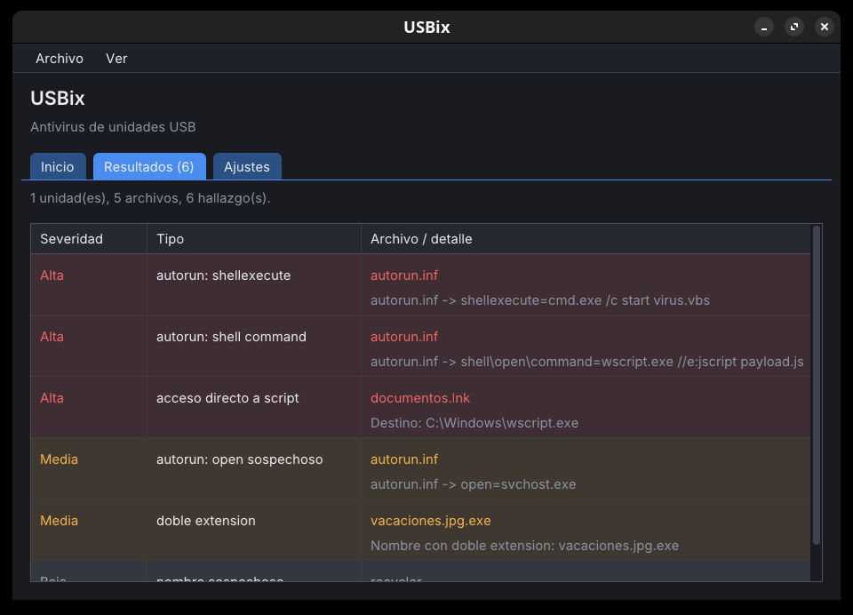
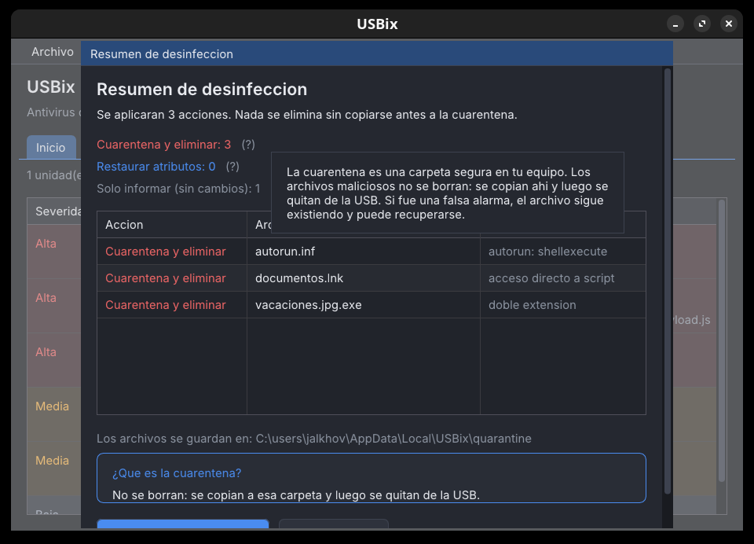
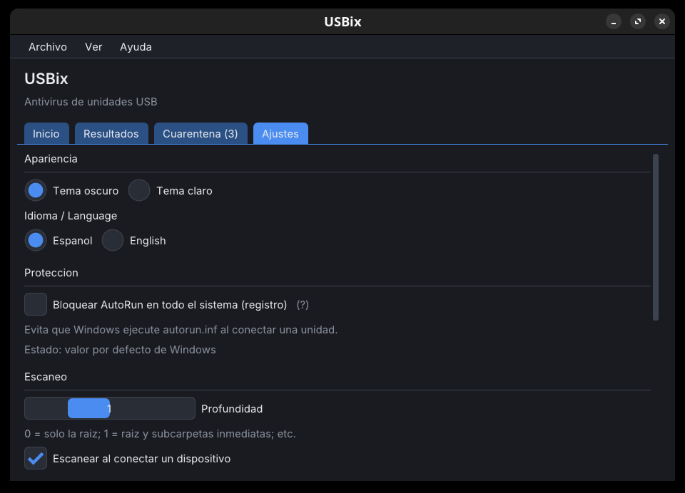

# USBix

**Antivirus ligero especializado en virus de USB para Windows.**

USBix vigila tus unidades USB, detecta el malware que se propaga por pendrives
(`autorun.inf`, accesos directos `.lnk`, scripts `VBS`/`JS`, dobles extensiones) y
lo pone en **cuarentena sin borrar tus archivos**. Además *vacuna* tus pendrives y
tu PC para que los virus no vuelvan a instalarse.

> USBix **no es un antivirus convencional**: es una herramienta complementaria
> centrada en el vector USB. Funciona junto a tu antivirus habitual.

## Descargar

### 👉 [Última versión (Releases)](https://github.com/Jalkhov/usbix-dist/releases/latest)

- `USBix-x.y.z-setup.exe` — **instalador** (recomendado).
- También hay versión **portable** (sin instalar) en algunos Releases.
- Requiere **Windows 7 SP1 o posterior** (32 y 64 bits).
- No necesita conexión a internet para analizar.

## Qué hace

- **Detecta** el malware típico de pendrives: `autorun.inf`, accesos directos
  `.lnk` maliciosos, scripts `VBS`/`JS`/`BAT`, dobles extensiones (`foto.jpg.exe`)
  y ejecutables empaquetados.
- **Desinfecta sin perder datos**: todo lo que se quita se **copia antes** a una
  cuarentena en tu equipo. Si algo no se puede copiar, **no se borra**. Antes de
  actuar, muestra un resumen de lo que va a hacer.
- **Vacuna** tus unidades USB (y el propio PC): impide que el virus vuelva a crear
  el `autorun.inf`, reforzado con permisos NTFS.
- **Revisa el PC**: detecta persistencia de malware (AutoRun, entradas del
  registro) y la repara con tu confirmación.
- **Avisa al conectar**: globo de *«unidad detectada → analizando»* y aviso con
  sonido cuando hay amenazas.
- **Vive en la bandeja**: puede iniciarse con Windows **oculto**, vigilando sin
  molestar.
- **Español e inglés**, tema oscuro o claro.

## Cómo se usa

1. Instala USBix y conecta cualquier pendrive: **se analiza solo**.
2. Si hay amenazas, aparece un aviso. Abre USBix y pulsa **Desinfectar**; verás el
   resumen de lo que se hará antes de tocar nada.
3. Pulsa **Vacunar** en tus unidades para protegerlas de futuras infecciones.

| Resumen de desinfección | Vacunación y ajustes |
|---|---|
|  |  |

## Actualizaciones

USBix incluye su propio actualizador: comprueba si hay versiones nuevas, muestra
las **novedades** y se actualiza solo. También mantiene al día sus reglas de
detección.

## Privacidad

Todo el análisis ocurre **en tu equipo**. No hay telemetría ni se envían tus
archivos a ningún servidor. La única conexión es la de **actualizaciones**
(GitHub), y siempre se verifica con firma digital antes de aplicar nada.

## Sobre los falsos positivos

USBix **todavía no está firmado digitalmente** (la firma Authenticode tiene un
coste que el proyecto no cubre), así que algunos antivirus pueden marcarlo por
error. Si te ocurre, puedes reportarlo como un falso positivo.

## Verificación de las descargas

Cada Release incluye el instalador y sus **hashes SHA-256**. Además, el
actualizador comprueba cada descarga contra un **manifest firmado (Ed25519)**, de
modo que solo se instalan versiones auténticas.

## Licencia

Software **gratuito** (*freeware*): se permite el uso personal y comercial, **sin
modificación ni redistribución**. El instalador muestra el contrato de licencia
(EULA). El **código fuente es privado**.

## Enlaces

- **Autor:** Pedro Torcatt (Jalkhov) — <https://linktr.ee/Jalkhov>
- **Descargas:** [Releases](https://github.com/Jalkhov/usbix-dist/releases/latest)

---

<b>English</b>

**USBix** is a lightweight antivirus focused on **USB-borne malware** for Windows.
It scans USB drives, detects `autorun.inf`, malicious `.lnk` shortcuts, `VBS`/`JS`
scripts and double extensions, and removes them **without deleting your files**
(everything is copied to quarantine first). It also *vaccinates* your drives so
the malware can't come back.

It is **not** a conventional antivirus — it's a complementary USB-focused tool.
Requires **Windows 7 SP1 or later**. Spanish and English UI. Free (closed source).

👉 **[Download the latest version](https://github.com/Jalkhov/usbix-dist/releases/latest)**

*This repository only holds distribution artifacts (installers in Releases, the
signed update manifest and the detection rules). The source code is private.*

